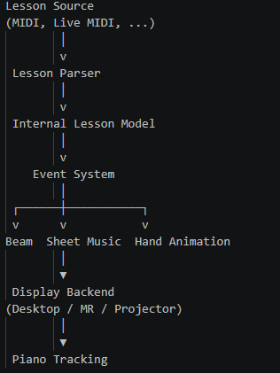

# ARPianoFramework

## Overview

This project aims to create a modular and extensible framework for Mixed Reality (MR) piano tutorials using the Unity3D game engine. Existing prototype implementations for piano visualization, synchronized teacher-student interaction, and desktop/HMD visualization are consolidated into a unified architecture that supports interchangeable modules for lesson authoring, visualization, display, and tracking.

The framework is intended as a research and development platform for immersive piano instruction across different hardware setups and interaction paradigms.

## Technologies

-> Unity 6
-> .NET
-> DryWetMidi (planned)
-> Vuforia / OpenCV (planned)
-> Meta XR SDK (planned)
-> Git

## Planned Architecture 

The framework is designed to be modular. Every major component should be replaceable without affecting the remaining system.

# Development Overflow 

The project will be developed incrementally. Every milestone should produce a working prototype before moving to the next one.

## Milestone 1 – Project Foundation

- [x] Create Unity project structure
- [x] Organize folders
- [x] Define interfaces
- [x] Create core architecture

## Milestone 2 – MIDI Integration

- [x] Import DryWetMIDI
- [x] Parse MIDI files
- [ ] Convert MIDI into internal note objects
- [ ] Print parsed notes for debugging

## Milestone 3 – Virtual Piano

- [ ] Create virtual keyboard
- [ ] Map MIDI notes to piano keys
- [ ] Highlight pressed keys

## Milestone 4 – Visualization

- [ ] Create Beam Visualizer
- [ ] Spawn beams for active notes
- [ ] Synchronize note timing
- [ ] Support multiple simultaneous notes

## Milestone 5 – Piano Tracking

- [ ] Detect piano from an image
- [ ] Align virtual keyboard
- [ ] Replace static image with webcam input
- [ ] Investigate Vuforia/OpenCV integration

## Milestone 6 – Modular Framework

- [ ] Introduce interchangeable visualizers
- [ ] Implement event-driven architecture
- [ ] Separate lesson, tracking, and visualization modules

## Milestone 7 – Mixed Reality Support

- [ ] Integrate XR support
- [ ] Test on Meta Quest
- [ ] Verify modular display pipeline

# Immediate Tasks

Current focus:

- [x] Design project architecture
- [x] Create folder structure
- [x] Define interfaces
- [x] Create `PianoNote` model
- [x] Research DryWetMIDI integration

No visualization or tracking should be implemented before the core architecture is in place.

# Future Features

- Multiple visualization modes
- Hand tracking
- Live MIDI keyboard input
- Markerless piano detection
- Automatic sheet music generation
- Additional lesson formats
- Performance recording and replay